# 大作业报告 Readme

 2023.09

## 1.架构

程序的类的设置如下图：

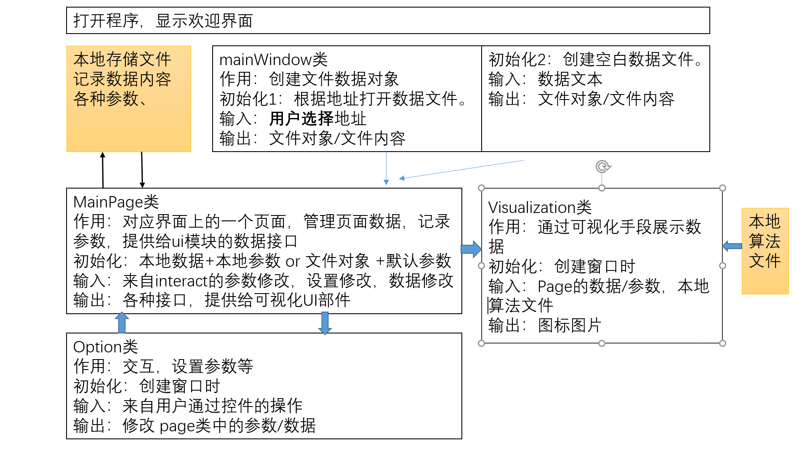

程序由一个MainWindow组成，并通过tab页来管理多个pages，每个page对应一个csv文件，mainwindow通过打开文件来添加pages。

Mainpage类管理一份数据，以及一系列chart，其中每个chart对应一列或者多列数据和一种分析方式，每个chart都带有option模块和可视化模块（chartview），可以调节具体的绘图格式、选项。

通过分层分类管理，有效避免了打开过多窗口的混乱问题。

## 2.功能

### 导入文件：

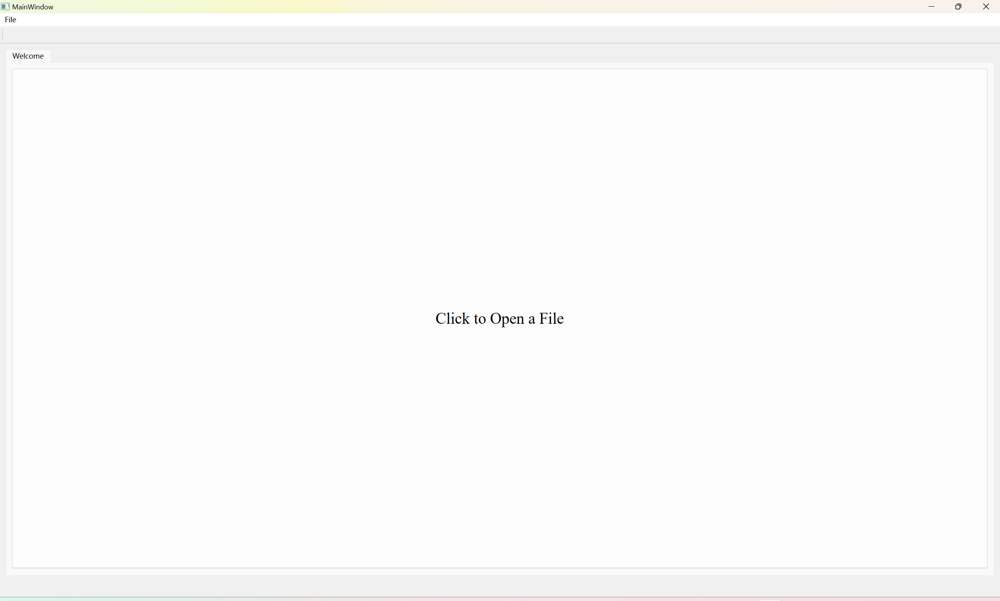

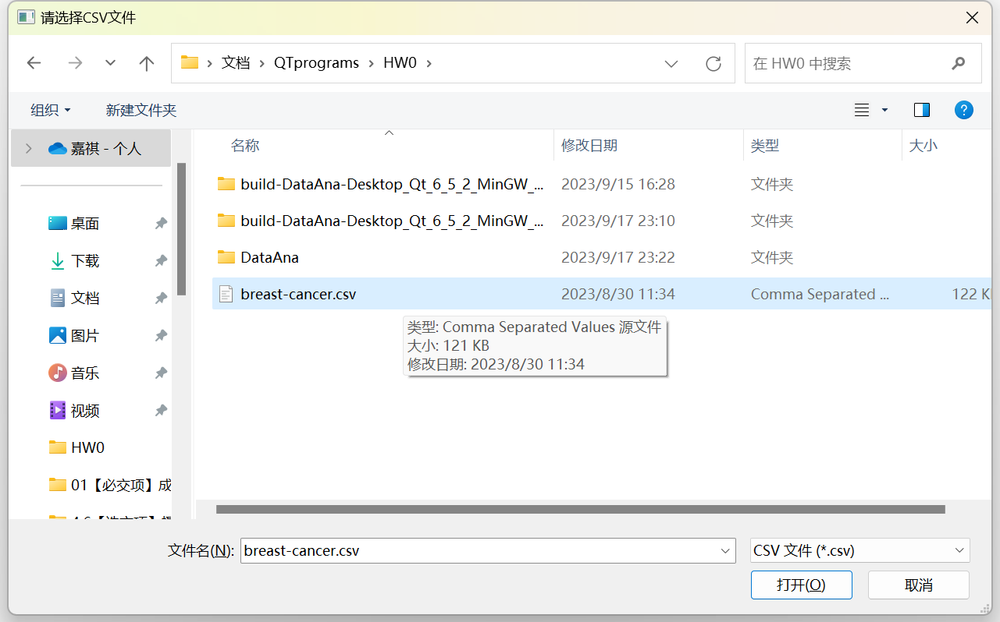

### 图表绘制：

展示数据，点击表头选中一列，点击**均值方差**可以进行计算，点击左下角直方图展示**直方图**，点击右侧绘制正态分布曲线可以选择是否绘制正态分布曲线。

拖动底部分段数量条可以调节直方图的分段数量。

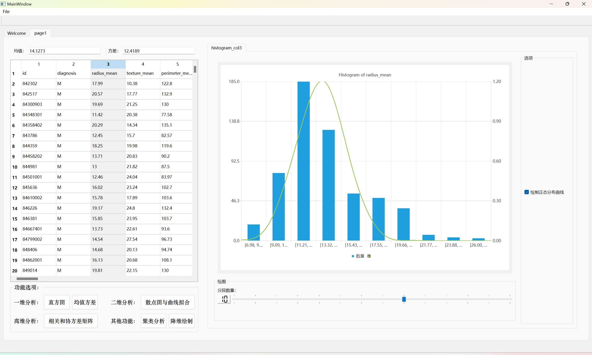

选择两列数据，点击散点图按钮绘制**散点图**，右侧可以选择是否进行拟合。选择后会显示p值和r^2，也可以调节拟合次数。鼠标靠近散点会显示具体信息。

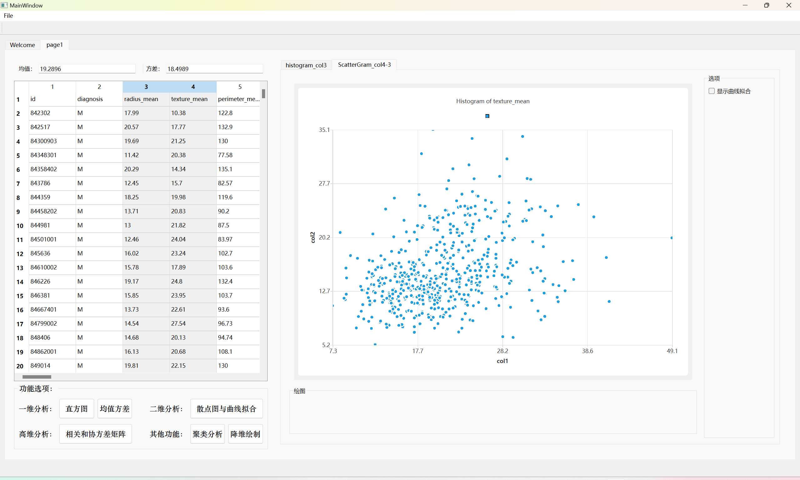

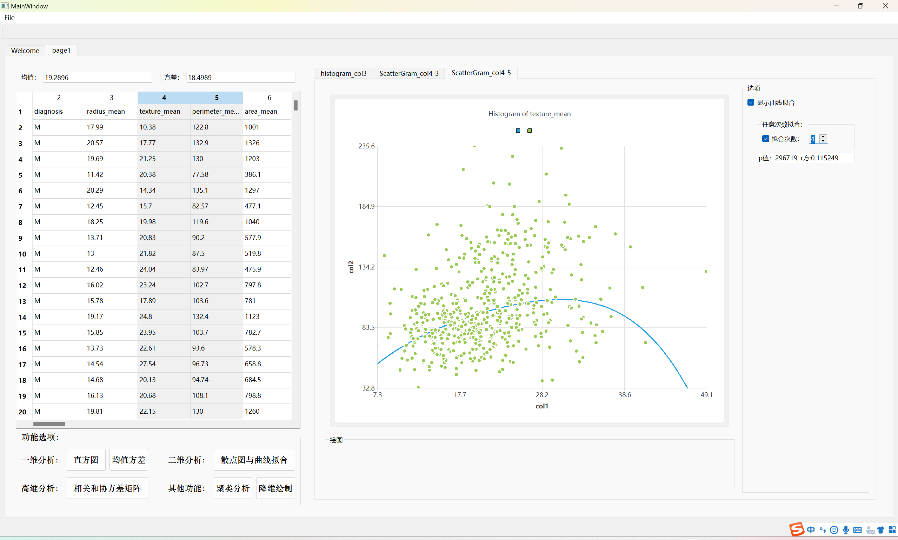

选择两列及以上，点击相关和协方差矩阵，可以绘制**相关性和协方差矩阵**。其中协方差矩阵为了更加直观，对取值进行了取对数操作，右侧可以切换协方差矩阵和相关性系数矩阵。

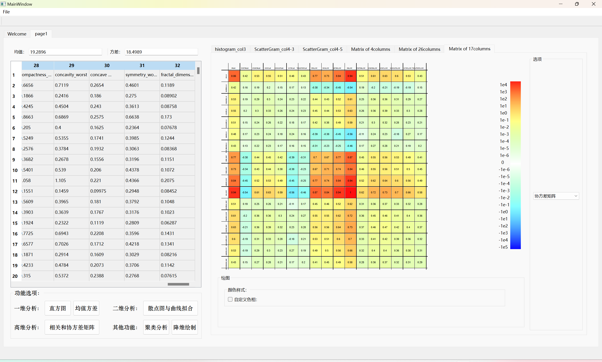

底部按钮和滑杆可以拖动，改变色相，可以调节并选择一个较为直观的颜色模式，也可以使用默认。

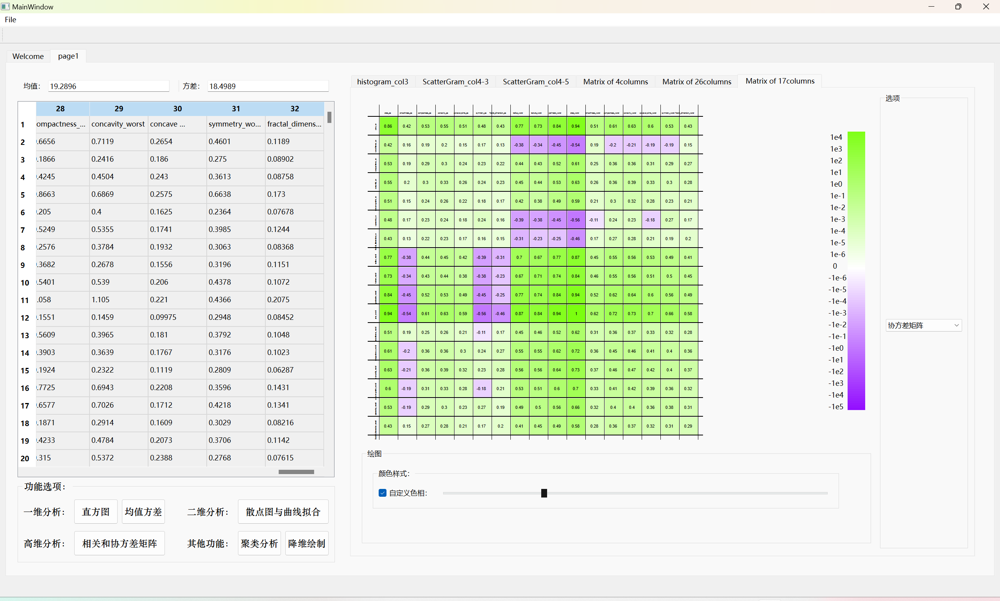

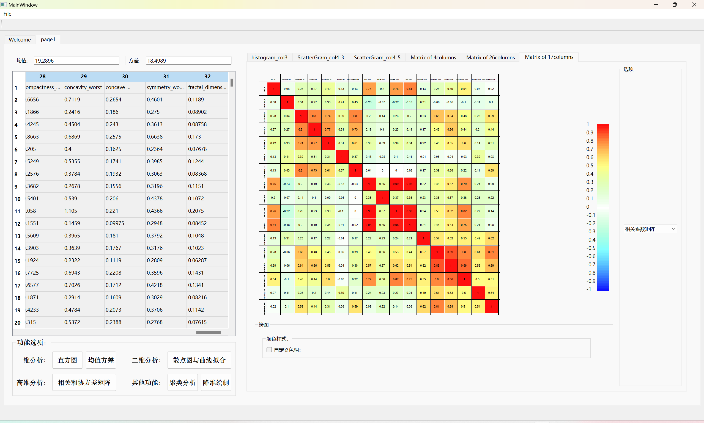

### 降维分析

选择多列，点击降维绘制即可生成数据降维至二维或者三维的结果，结果的两张图会同时输出到后边的窗口中，切换窗口即可查看不同维度的结果，染色根据BM来进行。二维图鼠标靠近会显示信息，三维图点击坐标点显示信息。

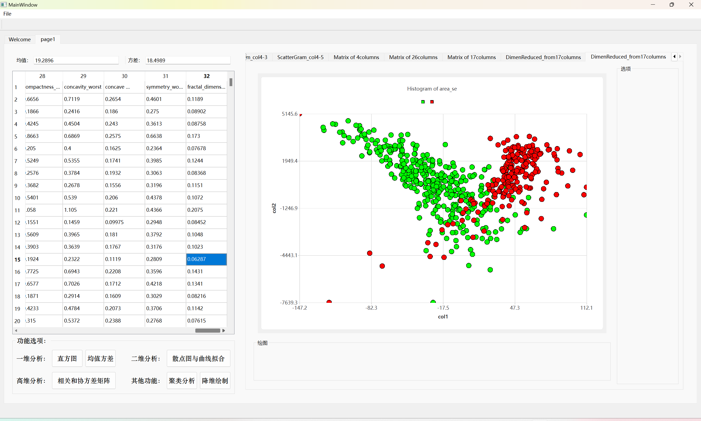

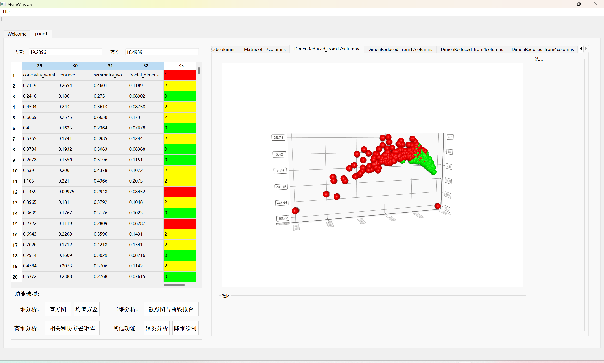

点击**聚类分析**，则会按照输入的聚类中心数进行聚类分析，并在表格栏染色。

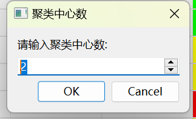

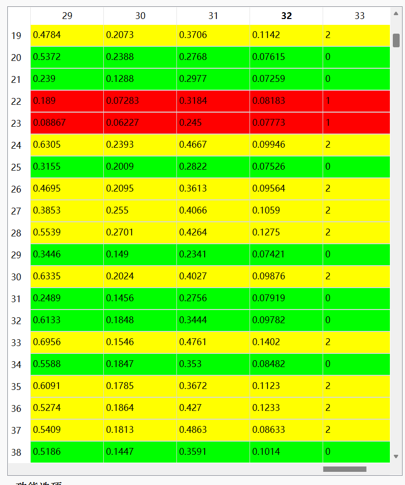

同时也会和降维分析一样在窗口栏生成两个降维结果图表，分别为二维和三维的结果

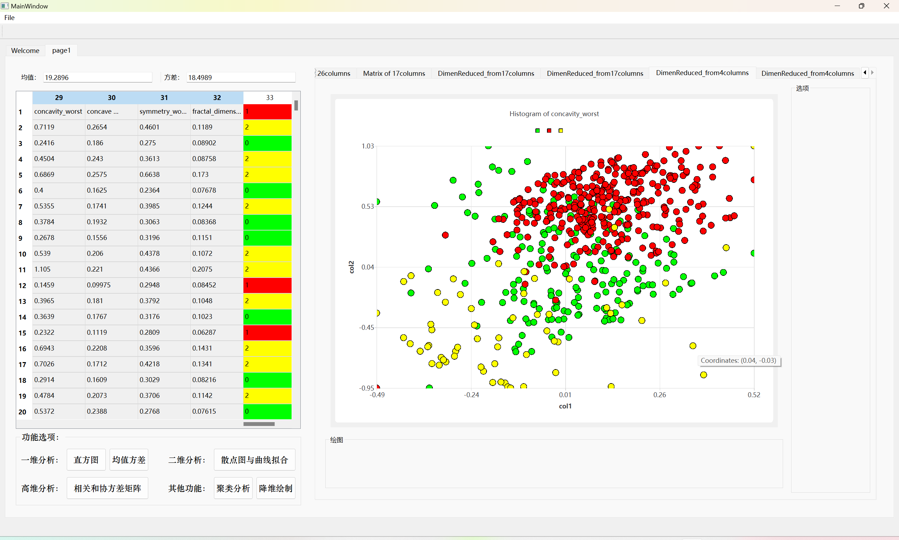

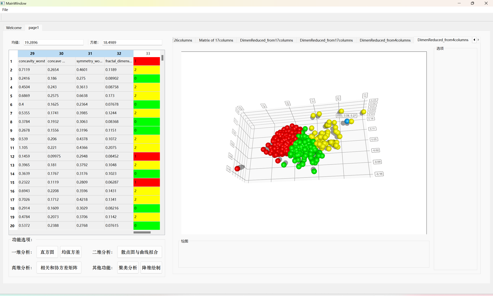
